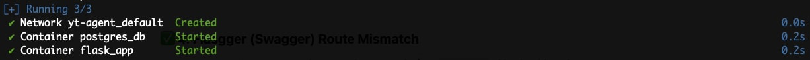
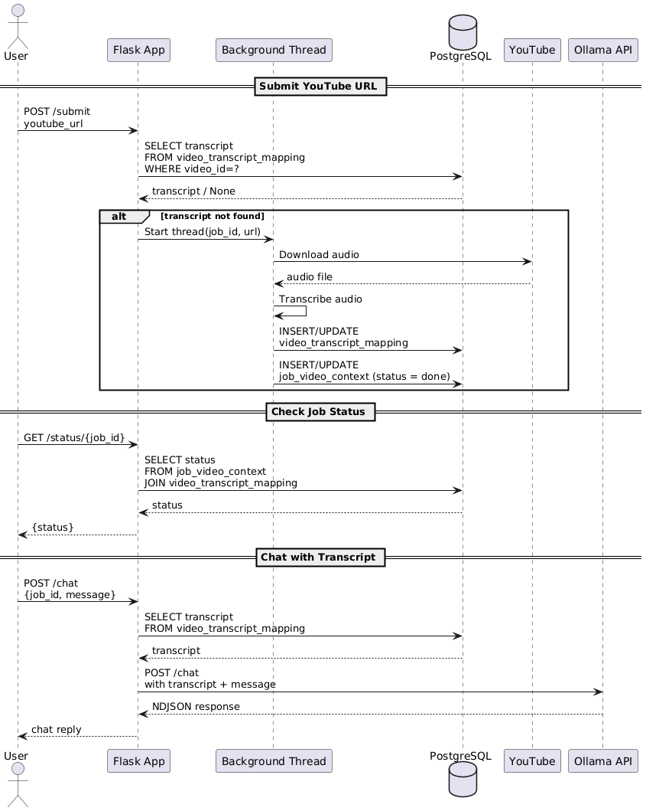
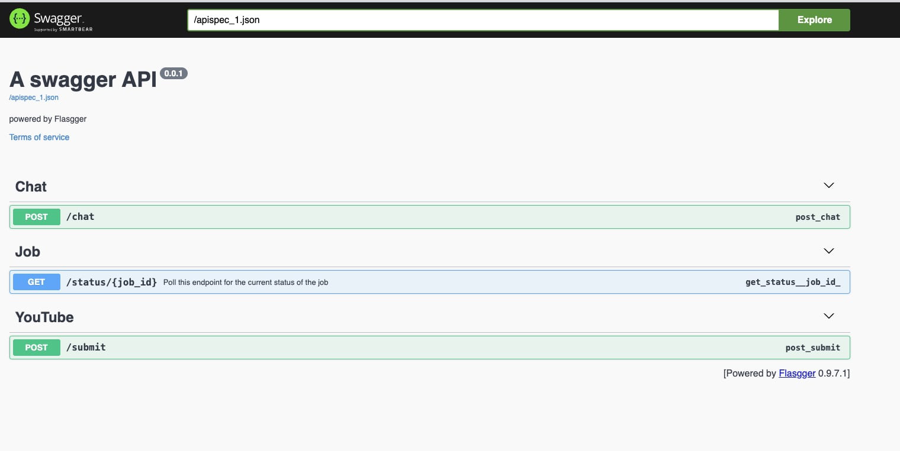
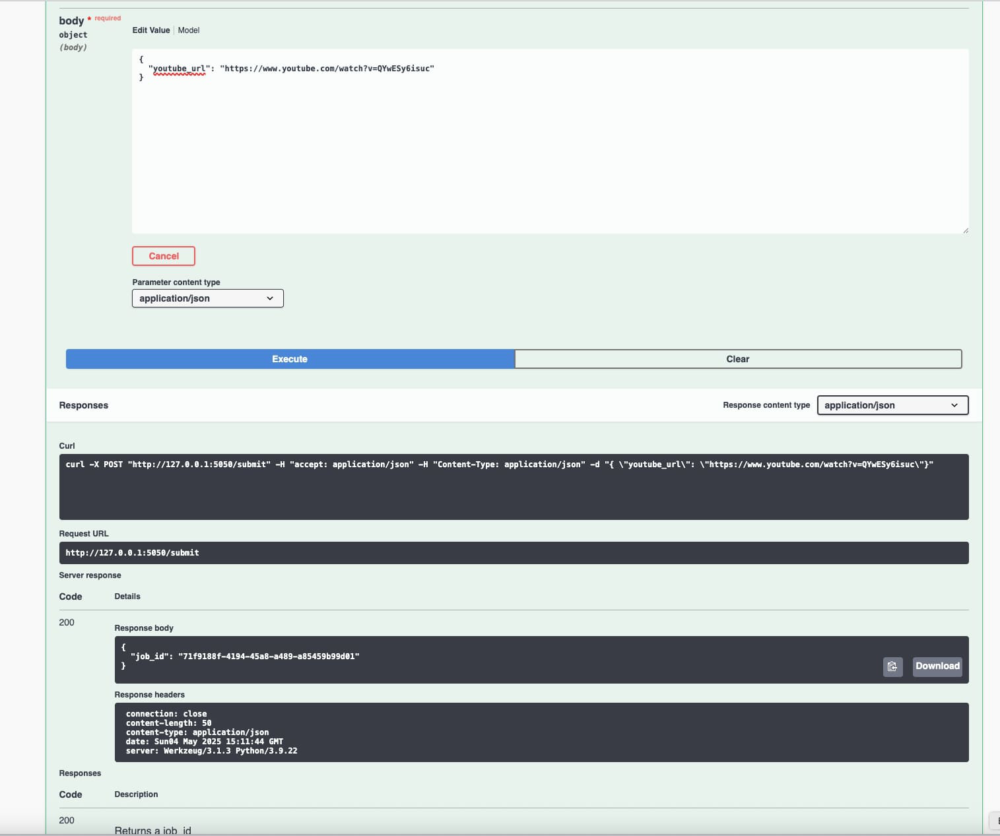
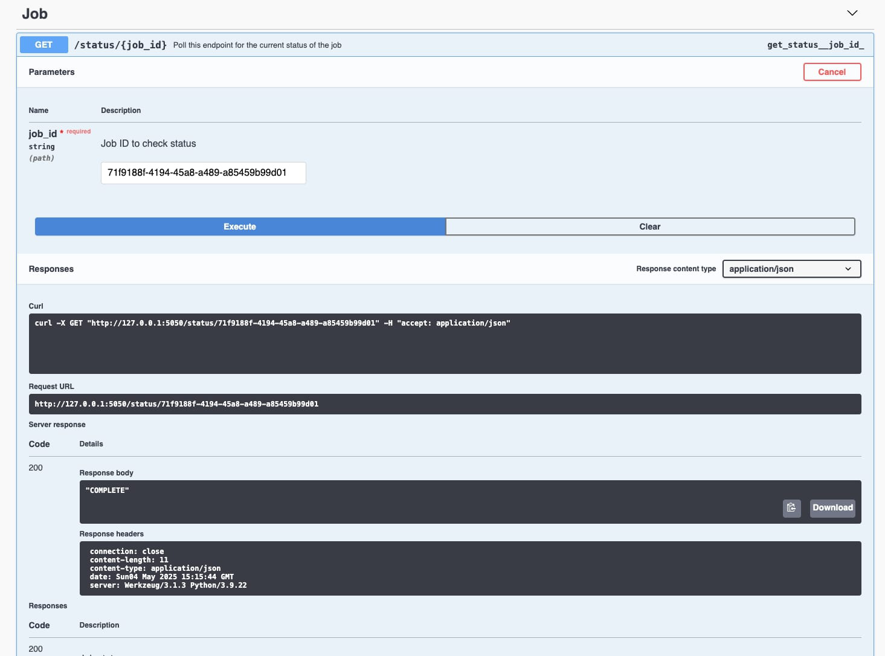
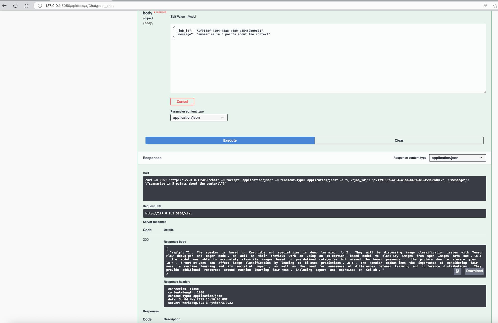
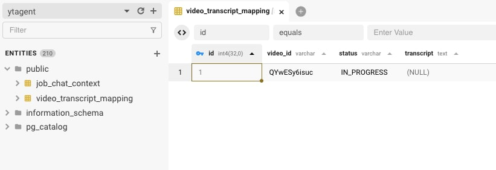
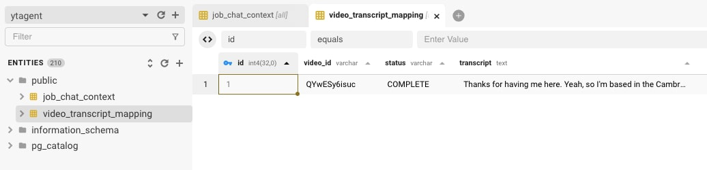
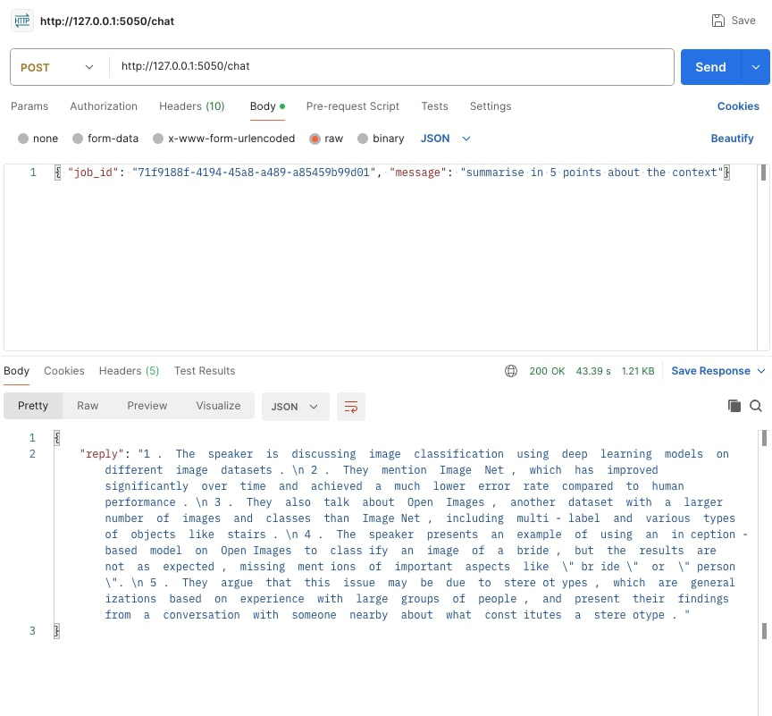
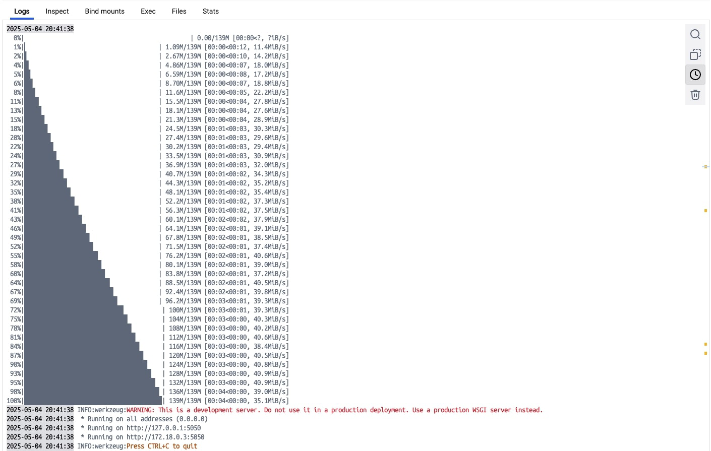

# 🎙️ YouTube Transcription & Chat Agent

A fast, offline-friendly **proof of concept (POC)** to transcribe YouTube videos and chat with the content using a local LLM via [Ollama](https://ollama.com/). Built with Flask, Whisper, PostgreSQL, and Mistral.

---

## ✅ Features

- 🧠 Transcribe YouTube audio using Whisper for Transcribe operation and Mistral Model for Chat
- 💬 Chat with transcript using **Ollama** (Mistral, LLaMA2, etc.)
- 📦 Local PostgreSQL-backed storage
- ⚙️ Configurable via `.env`

---

## 🔧 Prerequisites

- Python 3.10+
- Docker
- Ollama with mistral:7b-instruct-fp16 model

---

## 🚀 Getting Started

### 1. Clone the Project

```bash
git clone https://github.com/13shivam/yt-transcribe-chat-agent.git
cd yt-transcribe-chat-agent
````

### 2. Make sure a .env File exists
```bash
FLASK_APP=app.py
FLASK_ENV=development

# Ollama setup
OLLAMA_MODEL=mistral:7b-instruct-fp16
OLLAMA_API=http://localhost:11434/api/chat

# PostgreSQL connection
POSTGRES_HOST=localhost
POSTGRES_PORT=5432
POSTGRES_DB=ytagent
POSTGRES_USER=postgres
POSTGRES_PASSWORD=postgers

# Whisper model
WHISPER_MODEL=base
```

### 3. Run Local Ollama with Mistral Model (7b-instruct-fp16 - 14gb)
```bash
brew install ollama
ollama run mistral:7b-instruct-fp16
```
### 4. Run App
```bash
docker compose build --no-cache
docker compose up -d
```


### Access APIs via Swagger
http://127.0.0.1:5050/apidocs/#

### Sequence Diagram all APIs 


### Swagger API Local Demo


### Step 1: Upload API youtube URL


### Step 2: Check JobStatus


### Step 3: Initiate Chat from JobId


### Misc Screenshots
1. DB Screenshots


2. Chat API preview

3. Flask App Logs


### 🪪 WIP to add in future release: 
- Speaker Diarization support via open source `pyannote.audio` 